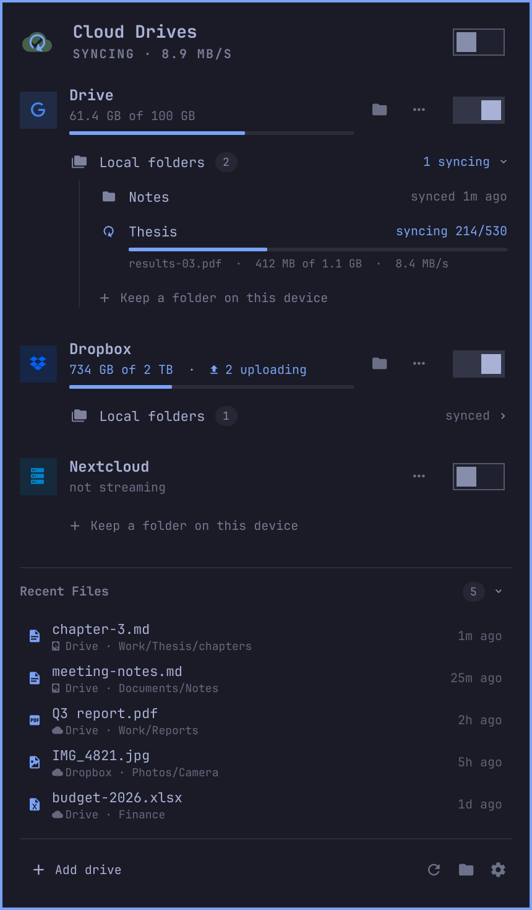
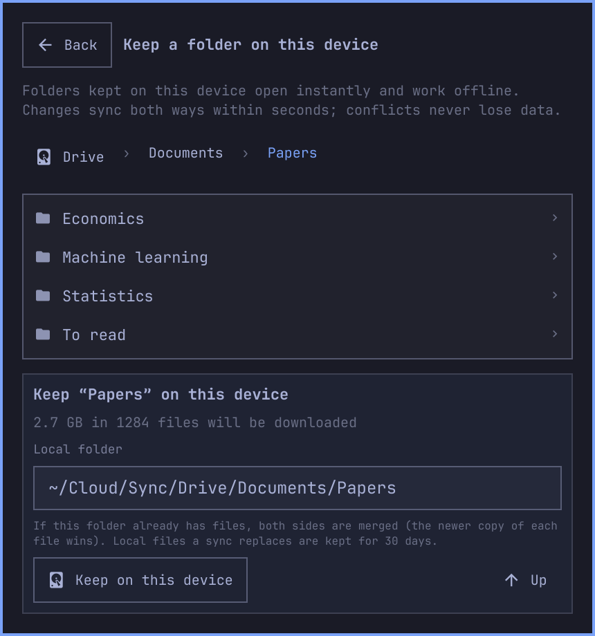
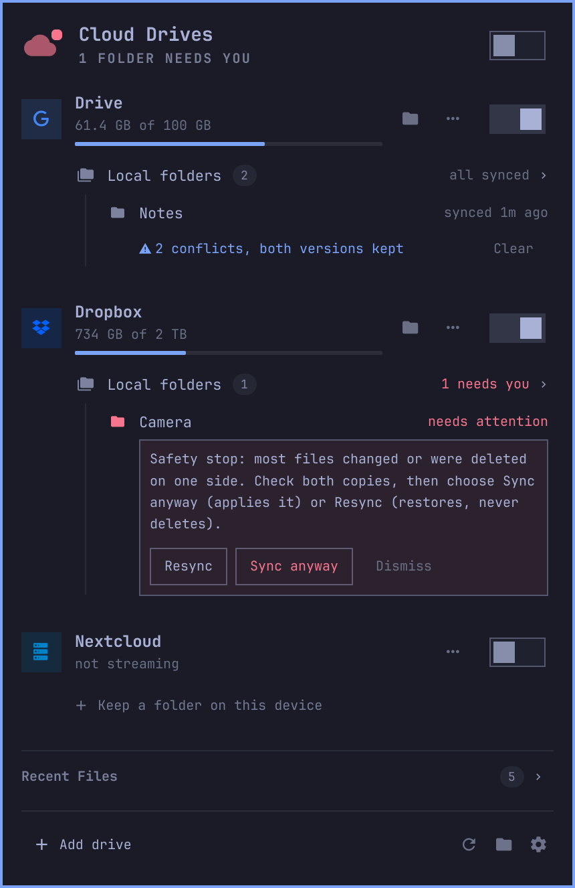
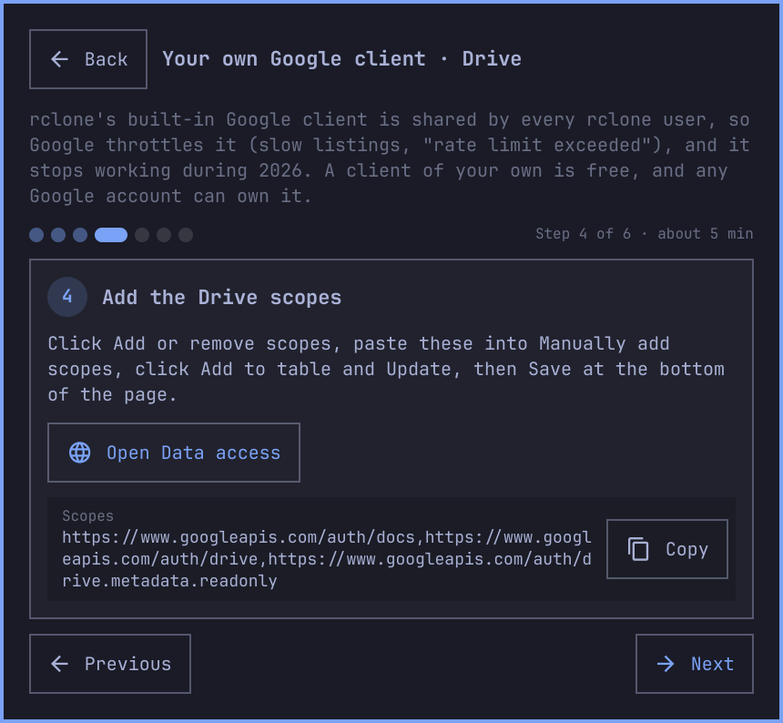
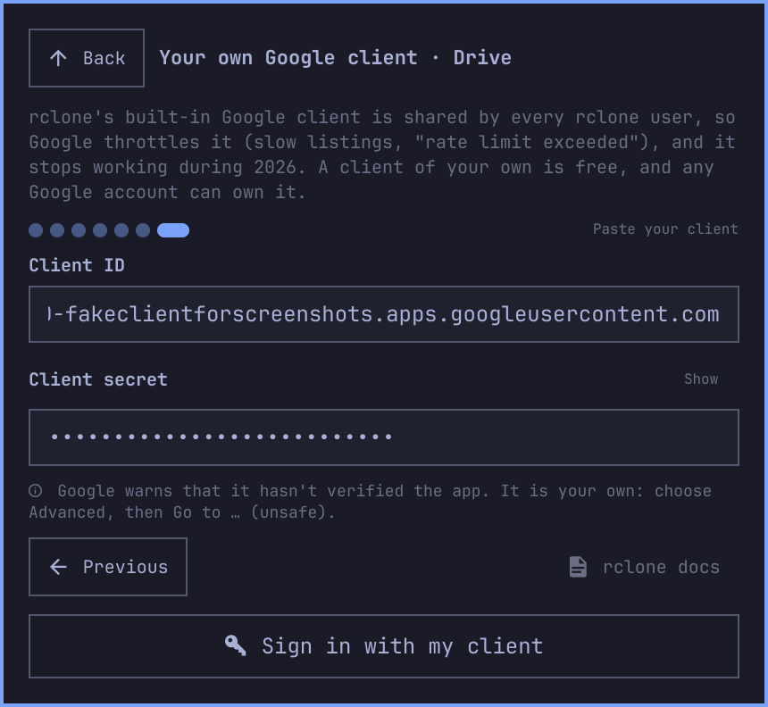
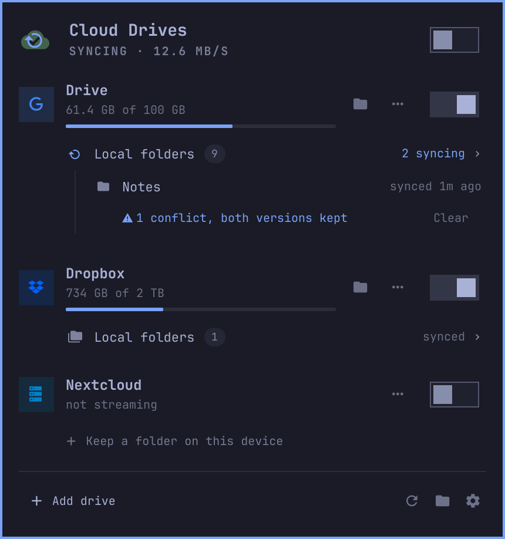
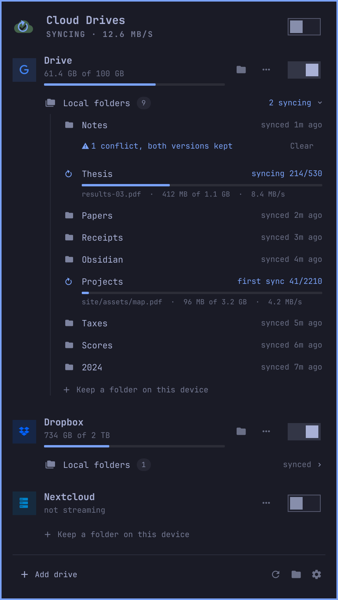
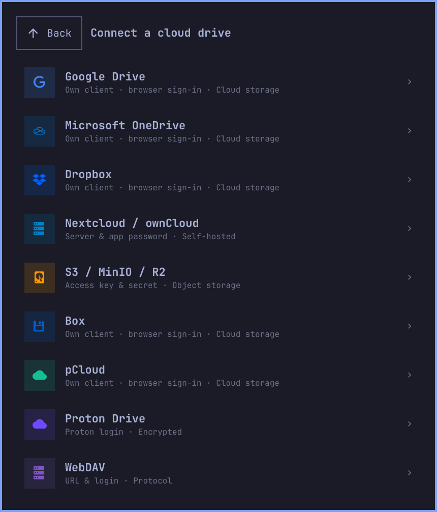
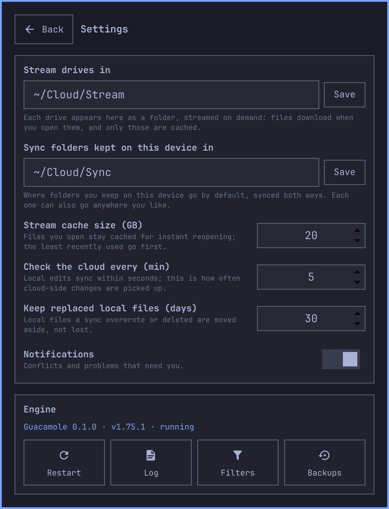

# Clouds Guacamole

An Omarchy bar widget and background service, built on [rclone](https://rclone.org), for your cloud drives:

- **Stream** whole drives without using disk space. Every drive shows up as a folder in `~/Cloud/Stream`, and files download when you open them.
- **Keep chosen folders on this device.** They are real local folders in `~/Cloud/Sync`, synced both ways: instant, available offline, and safe for apps that read many small files (Obsidian, git, IDEs).

It works with Google Drive, Dropbox, Microsoft OneDrive, Box, pCloud, Nextcloud and ownCloud, WebDAV, S3-compatible storage (AWS, MinIO, Cloudflare R2), Proton Drive, and any remote you have already set up with rclone.

<p align="center">
  
</p>

```
~/Cloud/
├── Stream/                  one folder per drive, streamed on demand
│   ├── Drive/
│   └── Dropbox/
└── Sync/                    folders kept on this device, synced both ways
    └── Drive/Documents/Notes/
```

Both locations can be changed in Settings, and each drive or folder can also live anywhere you like.

## Streaming

Turn on a drive's switch and it is mounted at `~/Cloud/Stream/<Drive>`. Browsing is instant once a folder has been listed. Files you open are cached, so reopening them is instant too. The cache is 20 GB by default; the least recently used files are evicted first. Edits upload a few seconds after you save. The card shows files still uploading, and unmounting waits for them; you can also choose *Unmount anyway*.

## Keep folders on this device

On a drive card, open **Local folders** and choose **Keep a folder on this device** (a drive with none shows it right away), browse to a folder and confirm. It is downloaded to `~/Cloud/Sync/<Drive>/<path>`, or anywhere else you pick. From then on:

- **Local edits reach the cloud within about 5 seconds.** The service watches the folder and syncs once you stop typing.
- **Cloud edits arrive on a timer** (every 5 minutes by default). They also arrive when you click 󰑐, right after resume from suspend, and when the network comes back.
- **Conflicts never lose data.** If a file changed on both sides, the newer copy wins and the other is kept next to it as `name.conflict1.ext`. The folder lists its conflicts and you get a notification.
- **Safety stop.** If most files disappear on one side (a wiped disk, an unmounted drive, a sync gone wrong), nothing is propagated. The folder asks you to choose between **Resync**, which merges both sides again and never deletes, and **Sync anyway**.
- **Replaced local files are kept** for 30 days under `~/.local/state/guacamole/backups/` (Settings → Engine → Backups).
- Editor temp files, `.DS_Store`, `Thumbs.db`, Obsidian's per-device `workspace.json` and similar files are never synced. The list is in `~/.config/guacamole/filters.txt` (Settings → Engine → Filters).

<table>
  <tr>
    <td valign="top" width="50%"></td>
    <td valign="top" width="50%"></td>
  </tr>
  <tr>
    <td align="center">Choosing a folder to keep</td>
    <td align="center">Conflicts and the safety stop</td>
  </tr>
</table>

Under the hood this is `rclone bisync` with `--resilient --recover`, `--conflict-resolve newer`, a 50% max-delete threshold and a local backup directory. Google Docs files are skipped, since they have no real size and can't round-trip.

Streaming and keeping folders are independent: a drive can be streamed, have local folders, both, or neither. A folder you keep is also visible inside the streamed drive. Work in the local copy; edits made through the stream reach it on the next sync.

## Your own OAuth client

Google Drive, Dropbox, OneDrive, Box and pCloud sign in through rclone's built-in OAuth client unless you give them your own. That built-in client is shared by every rclone user, so the providers throttle it. For Google Drive it is also being retired: **it stops working during 2026, so Google Drive needs a client of your own.**

Guacamole walks you through creating one, step by step, the same way for every one of these providers. The steps follow rclone's own documentation (pCloud's developer site for pCloud, which rclone doesn't cover). Each step has a button that opens the right console page and a copy button for the values to paste. At the end you paste the client ID and secret and sign in. The widget checks the format of what you paste, so a secret in the ID field or a OneDrive *Secret ID* instead of its *Value* is caught before signing in.

<table>
  <tr>
    <td valign="top" width="50%"></td>
    <td valign="top" width="50%"></td>
  </tr>
  <tr>
    <td align="center">Each step opens the right page and copies the values</td>
    <td align="center">Paste the client, then sign in</td>
  </tr>
</table>

- When adding any of these drives, the own-client setup is on by default (it can be switched off, except that Google Drive then warns it will stop working).
- On an existing drive, use **Set up** on the card's notice, or the drive's 󰇘 menu (*Set up my own client*). A drive that gets rate-limited offers it too.
- From a terminal: `guac set-client-id Drive` runs the same guided setup, and `guac client-guide dropbox` prints the steps.

| Provider     | Own client                                          | What you create                                       | Redirect URI              | rclone docs                                                                  |
| ------------ | --------------------------------------------------- | ----------------------------------------------------- | ------------------------- | ---------------------------------------------------------------------------- |
| Google Drive | **Needed** (shared client retiring, heavily throttled) | A *Desktop app* OAuth client in Google Cloud, about 5 minutes | none (loopback)           | [Making your own client_id](https://rclone.org/drive/#making-your-own-client-id) |
| Dropbox      | Recommended                                         | A scoped app with Full Dropbox access, about 3 minutes | `http://localhost:53682/` | [Get your own Dropbox App ID](https://rclone.org/dropbox/#get-your-own-dropbox-app-id) |
| OneDrive     | Recommended                                         | An app registration in Microsoft Entra ID with a client secret, about 5 minutes | `http://localhost:53682/` | [Getting your own Client ID and Key](https://rclone.org/onedrive/#getting-your-own-client-id-and-key) |
| Box          | Recommended                                         | A custom app with OAuth 2.0 user authentication, about 3 minutes | `http://127.0.0.1:53682/` | [Get your own Box App ID](https://rclone.org/box/#get-your-own-box-app-id) |
| pCloud       | Recommended                                         | An app with access to all folders, about 3 minutes    | `http://localhost:53682/` | [pCloud options](https://rclone.org/pcloud/); app console: [My applications](https://docs.pcloud.com/my_apps/) |

Nextcloud, WebDAV, S3 and Proton Drive have no OAuth client to create. Except on Google Drive, the card's notice can be hidden with ×. pCloud accounts in the EU and the US both work: after sign-in Guacamole asks pCloud which server holds the account, which `rclone authorize` alone can't tell.

## Why it stays fast

- **One long-running service.** `guacd` runs one `rclone rcd` that hosts every mount, and gives each running sync its own short-lived rclone process. The widget keeps one socket open and the service **pushes** changes, so nothing is polled and no process starts when the panel opens: it shows current data instantly.
- **Opening the panel never touches the network.** Recent files come from rclone's local cache records and from your local folders. Quotas refresh in the background.
- **Nothing blocks on a stalled mount.** The service never probes a mount on the main path; health comes from rclone's API and `/proc`, and the few unavoidable filesystem calls run on separate threads with timeouts. rclone itself gives up on a dead connection after 60 seconds.
- **Drives mount in parallel**, and mounting returns as soon as the mount is up.
- **Folders sync in parallel**, up to three at once, including several folders of the same drive. Each sync runs in its own rclone process, so its log, conflicts and errors are never mixed up with another folder's.
- **Tuned caching.** On backends that report changes (Google Drive, Dropbox, OneDrive, Box), folder listings stay cached for days and are refreshed by change notifications every 30 seconds. After mounting, the first two folder levels are prefetched in the background, so the file manager opens instantly.

## Install

Requirements: Omarchy 4 (Quickshell shell), `rclone`, `fuse3`, Python 3.10 or newer (standard library only).

```bash
omarchy plugin add https://github.com/chickymonkeys/clouds-guacamole --enable
```

Or from a checkout:

```bash
./install.sh           # copy into ~/.config/omarchy/plugins and enable the bar widget
./install.sh --link    # symlink instead, for development
./install.sh --uninstall
```

Running it again updates an existing install and restarts the shell and `guacd` so the new version loads (the shell only reloads a changed widget on restart); `--no-restart` skips that. `--no-enable` installs without adding the widget to the bar. `guacd` is left alone while files are uploading.

The widget starts `guacd` on demand as a transient systemd user unit (`guacamole.service`). It survives shell restarts and plugin reloads and stops cleanly at logout, and drives you were streaming are mounted again when it starts. To start it at login even without the bar widget, run `guac service install`.

Remotes already in your rclone config appear as drives right away, not streamed until you turn them on. If another program already mounted something at a drive's folder, the card says **in use elsewhere** and offers **Take over**.

## The widget

<p></p>

- **Bar icon.** Green when everything you asked for is healthy. Yellow when nothing is streaming or you're offline. Red with a dot when something needs you. It spins while files move. Left-click opens the panel, right-click syncs local folders now, middle-click streams or stops all drives.
- **Panel.** The header says the one thing worth knowing now: what needs you, syncing with its speed, offline, or up to date. The footer has *Add drive* and buttons to sync local folders now, open `~/Cloud` and open Settings. Keys: `a` add a drive, `s` settings, `r` sync now, `m` stream or stop all, `o` open `~/Cloud`, `Esc` back or close.
- **Drive cards.** Each card shows:
  - a streaming switch, and one line with the drive's quota and files still uploading, or its state when it isn't streaming;
  - problems, with a one-click fix: *Retry*, *Reconnect account*, *Take over*, *Set up my own client*;
  - rename, move, your own client and remove, behind 󰇘;
  - its local folders, in a dropdown.
- **Local folders.** A drive's folders sit behind one line with how many there are and what they are doing: *all synced*, *2 syncing*, *1 needs you*. Click it to list them, one line each with its state. Hover a folder for *Sync now*, *Open*, *Pause* and *Stop*, and its name for where it syncs. Progress, conflicts and anything that needs you show under it. Folders with conflicts or a problem stay listed while the list is closed, so nothing that needs you is behind a click. The panel remembers which lists you opened, and adding a folder opens its drive's list.
- **Settings.** Stream and sync locations, cache size, sync interval, backup retention and notifications. The **Engine** row has:
  - *Restart* (rclone);
  - *Log*, an in-panel viewer for Guacamole's and rclone's logs, with a problems-only filter, copy and open;
  - *Filters*, which opens `filters.txt` in your editor;
  - *Backups*, the local files syncs replaced or deleted (it says so when there are none yet).

<table>
  <tr>
    <td valign="top" width="50%"></td>
    <td valign="top" width="50%"></td>
  </tr>
  <tr>
    <td align="center">Local folders, closed</td>
    <td align="center">Local folders, open</td>
  </tr>
</table>

<table>
  <tr>
    <td valign="top" width="50%"></td>
    <td valign="top" width="50%"></td>
  </tr>
  <tr>
    <td align="center">Add Drive</td>
    <td align="center">Settings</td>
  </tr>
</table>

## Command line

```bash
guac status [--json]                    # drives, local folders, state
guac stream Drive on|off [--force]      # mount / unmount (also: guac mount|unmount Drive)
guac stream-all on|off
guac keep Drive:Documents/Notes [~/Notes]   # keep a folder on this device
guac unkeep Drive:Documents/Notes [--delete-local]
guac sync [FOLDER]                      # sync now
guac pause|resume FOLDER
guac resolve FOLDER resync|force|dismiss
guac browse Drive:Documents             # list folders
guac size Drive:Documents/Notes
guac add-oauth Work drive --own-client  # guided own client, then browser sign-in
guac add-credentials Home nextcloud < creds.json   # {"url": ..., "user": ..., "pass": ...}
guac set-client-id Drive                # guided; or --client-id ID (secret on stdin)
guac client-guide drive|dropbox|onedrive|box|pcloud
guac reconnect Drive
guac retry|takeover Drive
guac label Drive "Google Drive" ; guac set-path Drive ~/GDrive
guac config [KEY [VALUE]]               # mount_root, local_root, cache_max_size_gb, sync_interval_min, …
guac log [-n 200] [--daemon]
guac open [Drive]
guac daemon [--ensure] | guac stop | guac watch
guac service install|uninstall
```

`FOLDER` is a folder id, `REMOTE:PATH`, or the local path.

## Files

| Path                              | What                                                                       |
| --------------------------------- | -------------------------------------------------------------------------- |
| `~/Cloud/Stream/`, `~/Cloud/Sync/` | Streamed drives and folders kept on this device (both configurable)       |
| `~/.config/guacamole/config.json` | Settings, and per drive: streaming, mount path, local folders              |
| `~/.config/guacamole/filters.txt` | Never-synced patterns (editing it makes the next syncs safe resyncs)       |
| `~/.local/state/guacamole/`       | `state.json`, `daemon.log`, `rclone.log`, bisync work files, `backups/`    |
| `$XDG_RUNTIME_DIR/guacamole/`     | Private sockets: `daemon.sock` (widget, CLI), `rclone.sock` (rclone rc), `sync-<id>.sock` while a folder syncs |
| `~/.cache/rclone/vfs*`            | rclone's stream cache                                                      |

Accounts and credentials stay in rclone's own config (`~/.config/rclone/rclone.conf`). Secrets travel only over the private sockets and through the environment of `rclone authorize`, never on a command line, since every local user can read other processes' arguments.

## Development

```bash
tests/test_config.py   # settings, provider guides and client checks, path rules
tests/test_daemon.py   # end-to-end: real FUSE mounts and bisync on throwaway local remotes
```

The end-to-end suite runs `guacd` against two local rclone `alias` remotes in temporary directories, with its own rclone config. It covers:

- streaming and write-through, busy unmount, cleanup of empty mount folders;
- keeping folders local: syncing in both directions, deletions, conflicts, the safety stop and resync, and folders of one drive syncing in parallel;
- recent files;
- moving the stream and sync roots;
- recovery from an rclone crash, and taking over a foreign mount;
- path and client validation, logs, and clean shutdown.

The Python code is formatted and checked with [ruff](https://docs.astral.sh/ruff/) and [ty](https://docs.astral.sh/ty/) (`uv tool install ruff ty`; settings in `pyproject.toml`):

```bash
ruff format && ruff check && ty check
```

The screenshots in `docs/images` come from `docs/screenshots/render.py`, which runs the real widget off-screen against a demo `guacd` with made-up drives and folders (it needs Quickshell and the Omarchy shell).

## License

MIT, © 2026 Alessandro Pizzigolotto. See [LICENSE](LICENSE).

Parts of the bar widget are derived from [ODrive](https://github.com/TiniTinyTerminator/ODrive), © 2026 TiniTinyTerminator, released under the MIT License.
